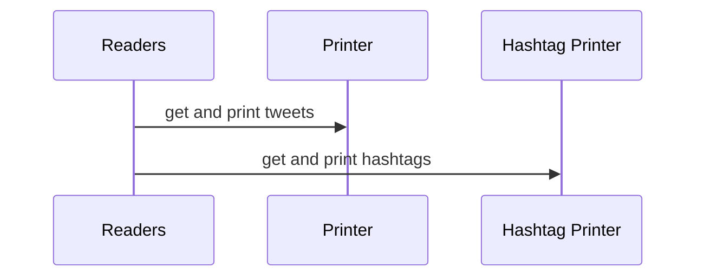
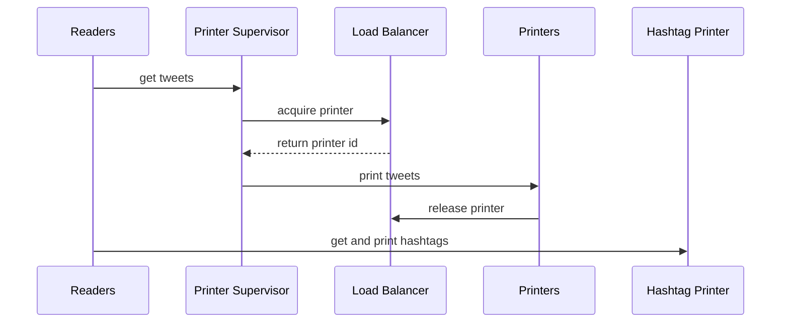
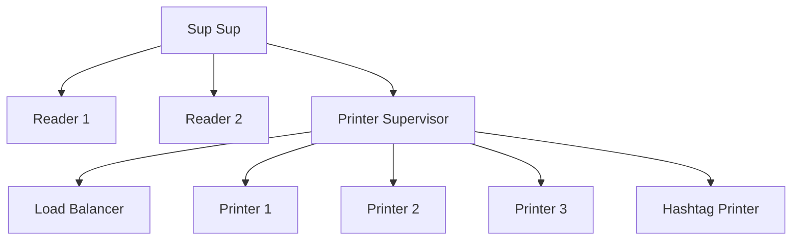
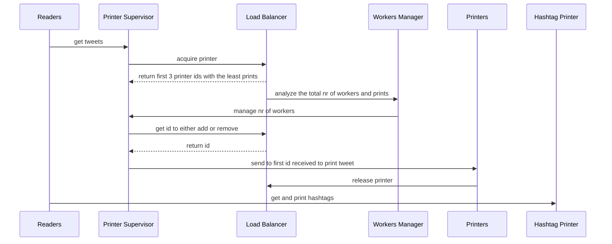
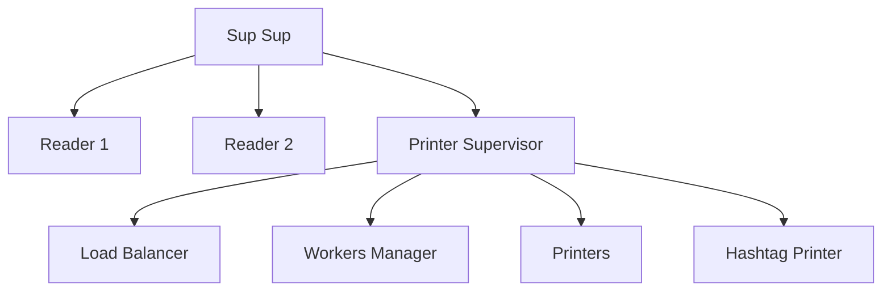
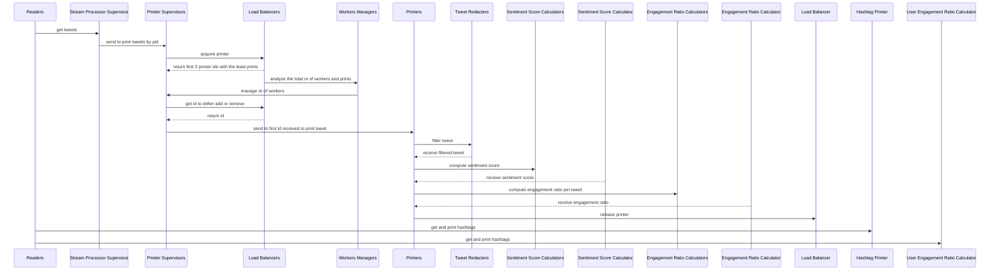
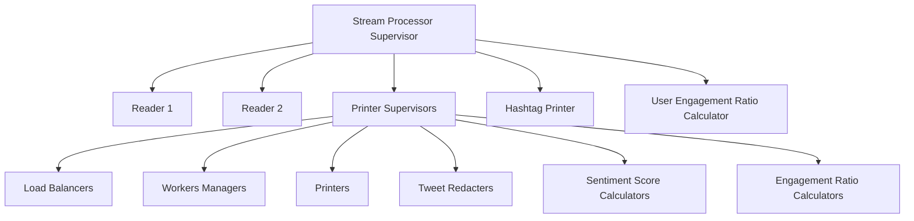
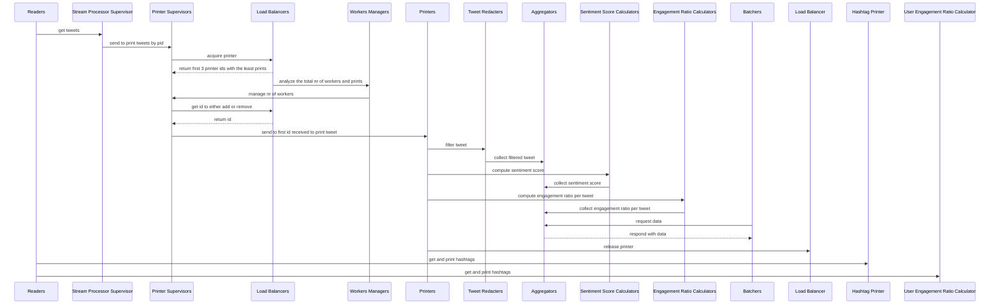
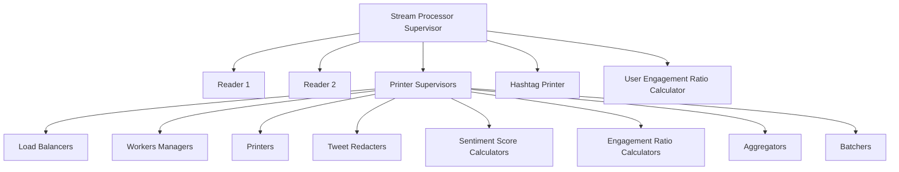
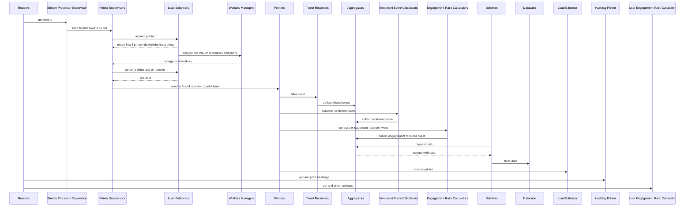

This repository contains the second laboratory work for the Real-Time Programming course:

## [Lab 1](Lab1)
| Weeks                | Progress           |
| :---:                | :---:              |
| Week 1               | :white_check_mark: |
| Week 2               | :white_check_mark: |
| Week 3               | :white_check_mark: |
| Week 4               | :white_check_mark: |
| Week 5               | :white_check_mark: |
| Week 6               | :white_check_mark: |

## Diagrams

### Week 1

#### Message Flow

#### Supervision Tree

### Week 2

#### Message Flow

#### Supervision Tree

### Week 3

#### Message Flow

#### Supervision Tree

### Week 4

#### Message Flow

#### Supervision Tree

### Week 5

#### Message Flow

#### Supervision Tree

### Week 6

#### Message Flow

#### Supervision Tree

